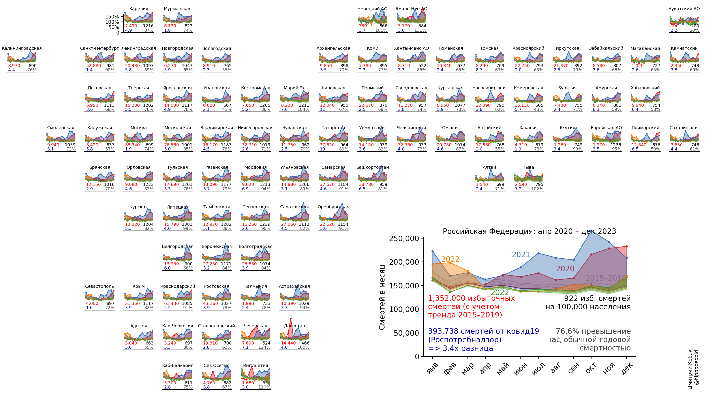
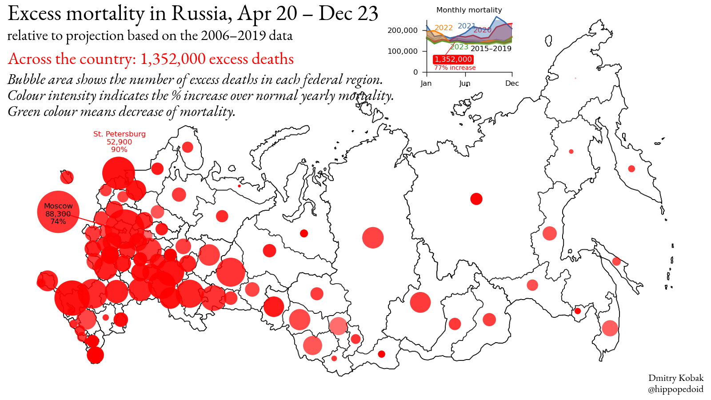

# Excess mortality during the covid19 pandemics

Code: https://github.com/dkobak/excess-mortality/blob/main/all-countries.ipynb 
Run in browser: https://colab.research.google.com/github/dkobak/excess-mortality/blob/main/all-countries.ipynb 

The data are sourced from the Human Mortality Database (and removing the last two weeks), FT, and NYT. Ukraine data scraped by Иван Зайцев <a href="https://navizv.github.io/covid">here</a>. Excess mortality is computed relative to the baseline using linear extrapolation of the 2015–19 trend. 

Red: excess mortality starting from the first officially reported covid19 death. 
Gray: excess mortality as a % of the usual yearly deaths. 
Black: excess mortality per 100,000 population. 
Blue: ratio to the daily reported deaths over the same period (sourced from https://ourworldindata.org/covid-deaths).

  
Compare with: 
FT: https://www.ft.com/content/a2901ce8-5eb7-4633-b89c-cbdf5b386938 
NYT: https://www.nytimes.com/interactive/2020/04/21/world/coronavirus-missing-deaths.html  
The Economist: https://www.economist.com/graphic-detail/2020/07/15/tracking-covid-19-excess-deaths-across-countries 

--------------------------

# Excess mortality in Russia

Code: https://github.com/dkobak/excess-mortality/blob/main/russia.ipynb

  

Animation (English):

Animation (Russian):

  

Map (English):

Map (Russian):

Without regions:

Detailed statistics in regions with the most excess deaths:

Daily reported covid19 mortality and estimated excess mortality across the countries with the most reported covid19 deaths. Undercount estimates are taken from The Economist, NYT, Financial Times, and other sources. Note that in this figure the excess mortality in all countries is ESTIMATED using the undercount coefficient times the latest daily reported number of deaths:

### Some technical figures

Extrapolation of the linear trend:

Seasonal variation:

Evolution of the undercount coefficient:

