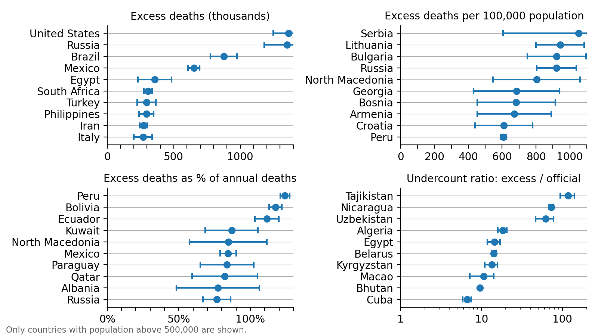
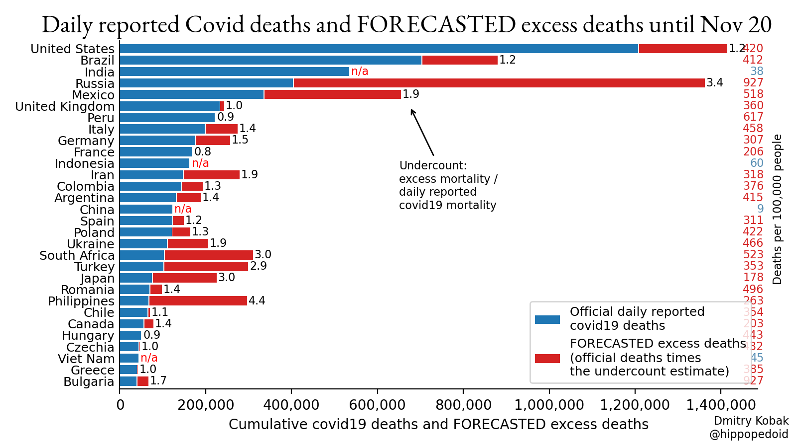
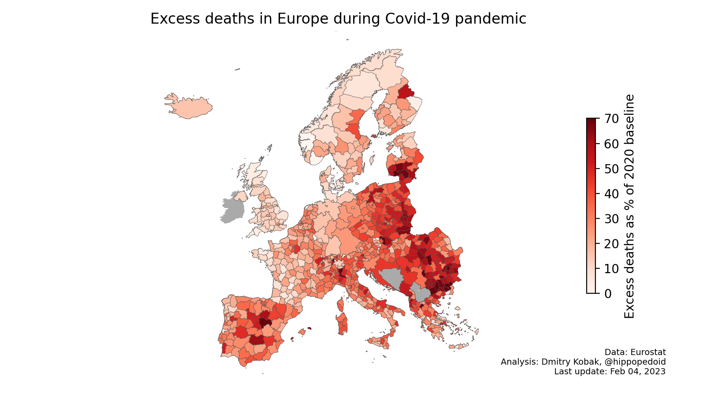
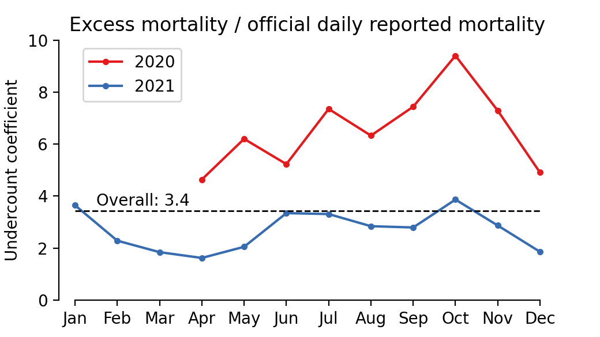
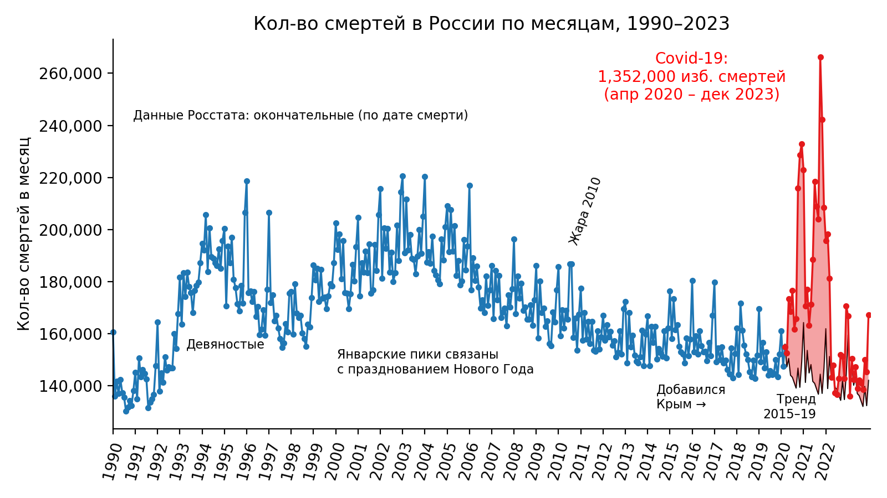

# Excess mortality during the COVID-19 pandemic

**Publication:** Karlinsky & Kobak, 2021, Tracking excess mortality across countries during the COVID-19 pandemic with the World Mortality Dataset. *eLife* 10:e69336. https://elifesciences.org/articles/69336.

See the [`elife2021`](https://github.com/dkobak/excess-mortality/blob/main/elife2021/) folder for reproducible analysis from the paper. The figures shown below are being continuously updated after the publication.

-------------------------------

Analysis code: [`all-countries.ipynb`](https://github.com/dkobak/excess-mortality/blob/main/all-countries.ipynb) (can be [run in Colab](https://colab.research.google.com/github/dkobak/excess-mortality/blob/main/all-countries.ipynb)).

The data are sourced from the [World Mortality Dataset](https://github.com/akarlinsky/world_mortality). Excess mortality is computed relative to the baseline obtained using linear extrapolation of the 2015–19 trend (different baselines for 2020, 2021, and 2022). In each subplot in the figure below, gray lines are 2015–19, black line is baseline for 2020, red line is 2020, blue line is 2021, orange line is 2022, green line is 2023. Countries are sorted by the total excess mortality as % of the 2020 baseline.

Red number: excess mortality starting from the first officially reported Covid-19 death. 
Gray number: excess mortality as a % of the annual (2020) baseline deaths. 
Black number: excess mortality per 100,000 population. 
Blue number: ratio to the daily reported Covid-19 deaths over the same period (sourced from WHO).

  
The same data but now represented as the number of deaths per 1000 people per year, and with countries sorted accordingly:
  

Top-10 countries in the World Mortality Dataset according to different metrics (only countries with over 500,000 population are shown): 

See full table in CSV: [`excess-mortality.csv`](https://github.com/dkobak/excess-mortality/blob/main/excess-mortality.csv). Compare with: [FT](https://www.ft.com/content/a2901ce8-5eb7-4633-b89c-cbdf5b386938), [NYT](https://www.nytimes.com/interactive/2020/04/21/world/coronavirus-missing-deaths.html), [The Economist](https://www.economist.com/graphic-detail/coronavirus-excess-deaths-tracker), [WSJ](https://www.wsj.com/articles/the-covid-19-death-toll-is-even-worse-than-it-looks-11610636840). 

The same figure without the projections (as in the paper): 

  

Tracking of excess mortality and official Covid deaths:
  

<em>Note: On March 1, 2023, I removed the European 2020 heatwave correction that we did in the eLife paper. There were multiple heatwaves since then, and we are not able to systematically correct for it always. So this correction has been dropped.</em>

### Extrapolation until today
Daily reported Covid-19 mortality and estimated excess mortality across the countries with the most reported Covid-19 deaths. Note that in this figure the excess mortality in all countries is FORECASTED using the undercount coefficient and the LATEST daily reported number of deaths. So this corresponds to the gray markers in the figure above.

--------------------------

## Excess mortality in Europe by NUTS regions

The code is in the `europe-nuts.ipynb` notebook. The weekly data are sourced from Eurostat, excess mortality is computed using the WMD model (i.e. accounting for yearly trend and extrapolating it forward; total excess is the sum from 2020, week 10, onwards). I am using NUTS3 regions in most places, but NUTS2 are used in Belgium, Netherlands, and UK because there NUTS3 appear too small on this map (London is shown as NUTS1), and also in Serbia because I am not sure NUTS3 data are reliable.

Caveat: UK data in Eurostat are only available for 2020, meaning that excess mortality in 2021 is not taken into account.

See also <a href="img/europe_nuts_excess_per_100k_animation.mp4?raw=true">animation of weekly excess mortality</a>.

The same figure by P-scores:

--------------------------

## Excess mortality in Russia

The code for my February 2021 paper in *Significance* [Excess mortality reveals Covid's true toll in Russia](https://rss.onlinelibrary.wiley.com/doi/10.1111/1740-9713.01486) is available in the `significance2021` folder, together with the frozen data and the final figures.

Figures below are updated every month. The up-to-date data can be found in the `russian-data` folder. Code: [`russia.ipynb`](https://github.com/dkobak/excess-mortality/blob/main/russia.ipynb). I am using monthly data _by date of death_ for all years up to 2021, and monthly date _by date of registration_ starting from 2022 (as the data by date of death are not yet available). The data by date of death were provided by Rosstat upon my request. (Note that the dataset includes deaths with known year but unknown month of death; I redistributed those proportionally to the deaths with known month of death.) Thanks to [Alexey Raksha](https://www.facebook.com/100001739601178) for helpful discussions.
  
Note: at the moment all estimates are in this section are made using the same 2020 baseline for all years (2020, 2021, 2022). I plan to change it to using different baselines for each year, as above.

  

Note that ~10 thousand excess deaths in July in the Ural region and West Siberia were due to the heat wave (see also below).
  

Animation (English):

Animation (Russian):

  

Map (English):

Map (Russian):

Country as a whole:

  

Yearly deaths:

Back in 2019 Rosstat made <a href="https://rosstat.gov.ru/folder/12781">forecast until 2035</a> (<a href="https://rosstat.gov.ru/storage/mediabank/progn5.xls">xls</a>). Upper/lower/middle forecasts are shown with dashed lines. The actual number in 2019 was 1,798,307. The actual number in 2020 was 2,138,586 (forecast: 1.7890 mln; 1.7413--1.8304). The actual number in 2021 was 2,441,594 (forecast: 1.7877 mln; 1.7158--1.8481).

Detailed statistics in regions with the most excess deaths:

Evolution of the undercount coefficient:

Seasonal variation:

Detailed history of monthly deaths:

  
### Weekly data
  

Excess based on weekly data (by date of death) from http://mortality.org (only 2020 data are available so far; note that these weekly data do not include Crimea and do not include deaths with unknown week of death):

  

Note the bump in weeks 28--29: that is the effect of the heatwave (e.g. in Ufa it was very hot from 10th to 20th of July, precisely these two weeks: http://www.pogodaiklimat.ru/monitor.php?id=28722&month=7&year=2020). It contributed around 4 thousand excess deaths per week, i.e. around 8 thousand in total, on top of the excess Covid-related mortality.

The same split by gender and narrow age groups (using "input" data to STMF shared at http://mortality.org). Here I use linear trend based only on 2018-19 for linear extrapolation:

And as summary across age groups:
  

  
