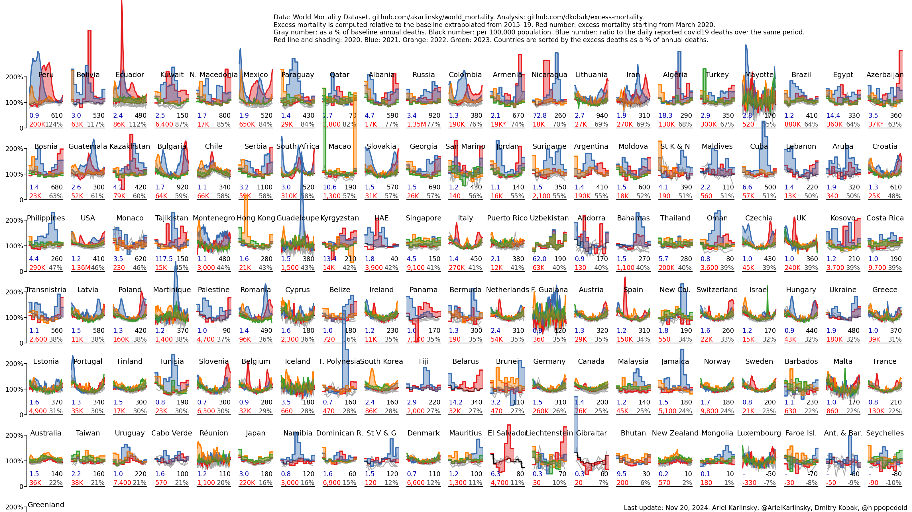
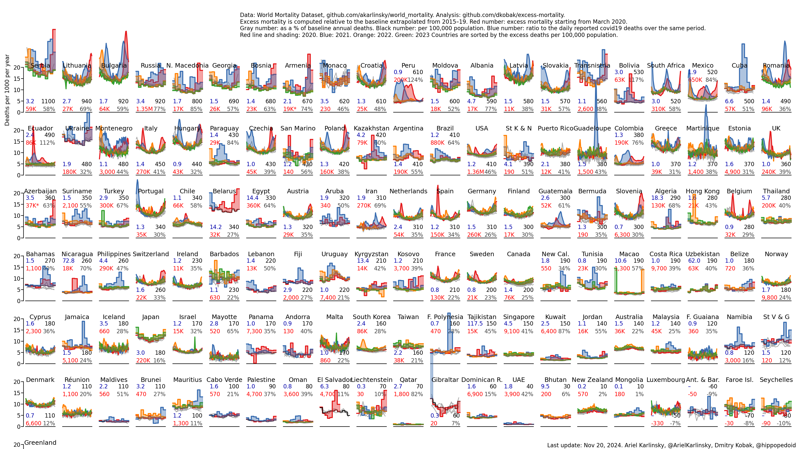
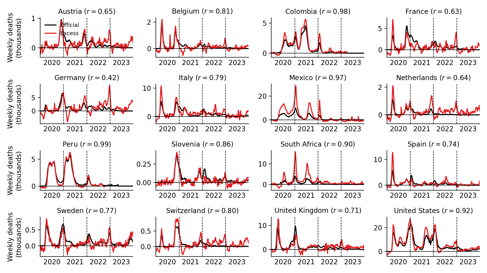
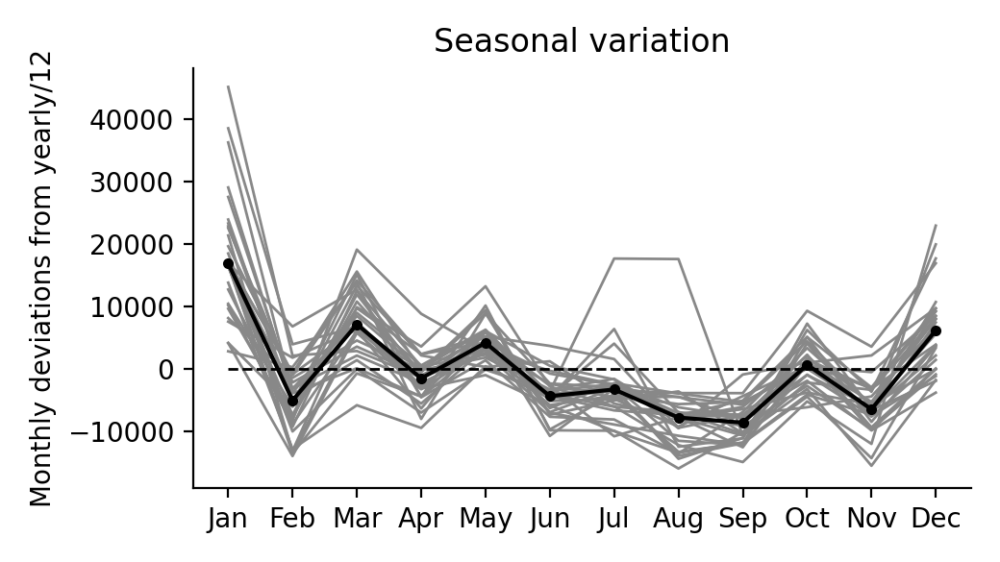

# Excess mortality during the COVID-19 pandemic

**Publication:** Karlinsky & Kobak, 2021, Tracking excess mortality across countries during the COVID-19 pandemic with the World Mortality Dataset. *eLife* 10:e69336. https://elifesciences.org/articles/69336.

See the [`elife2021`](https://github.com/dkobak/excess-mortality/blob/main/elife2021/) folder for reproducible analysis from the paper. The figures shown below are being continuously updated after the publication.

-------------------------------

Analysis code: [`all-countries.ipynb`](https://github.com/dkobak/excess-mortality/blob/main/all-countries.ipynb) (can be [run in Colab](https://colab.research.google.com/github/dkobak/excess-mortality/blob/main/all-countries.ipynb)).

The data are sourced from the [World Mortality Dataset](https://github.com/akarlinsky/world_mortality). Excess mortality is computed relative to the baseline obtained using linear extrapolation of the 2015–19 trend. In each subplot in the figure below, gray lines are 2015–19, black line is baseline for 2020, red line is 2020, blue line is 2021. Countries are sorted by the % increase over the baseline.

Red number: excess mortality starting from the first officially reported Covid-19 death. 
Gray number: excess mortality as a % of the annual baseline deaths. 
Black number: excess mortality per 100,000 population. 
Blue number: ratio to the daily reported Covid-19 deaths over the same period (sourced from WHO).

  
The same data but now represented as the number of deaths per 1000 people per year, and with countries sorted accordingly:
  

Top-10 countries in the World Mortality Dataset according to different metrics (only countries with over 500,000 population are shown): 

See full table in CSV: [`excess-mortality.csv`](https://github.com/dkobak/excess-mortality/blob/main/excess-mortality.csv). Compare with: [FT](https://www.ft.com/content/a2901ce8-5eb7-4633-b89c-cbdf5b386938), [NYT](https://www.nytimes.com/interactive/2020/04/21/world/coronavirus-missing-deaths.html), [The Economist](https://www.economist.com/graphic-detail/coronavirus-excess-deaths-tracker), [WSJ](https://www.wsj.com/articles/the-covid-19-death-toll-is-even-worse-than-it-looks-11610636840). 

The same figure without the projections (as in the paper): 

See also <a href="img/leaderboard-paper-2020.png?raw=true">the same figure for 2020 on its own</a>.

  

Tracking of excess mortality and official Covid deaths:
  

### Extrapolation until today
Daily reported Covid-19 mortality and estimated excess mortality across the countries with the most reported Covid-19 deaths. Note that in this figure the excess mortality in all countries is FORECASTED using the undercount coefficient and the LATEST daily reported number of deaths. So this corresponds to the gray markers in the figure above.

--------------------------

## Excess mortality in Russia

The code for my February 2021 paper in *Significance* [Excess mortality reveals Covid's true toll in Russia](https://rss.onlinelibrary.wiley.com/doi/10.1111/1740-9713.01486) is available in the `significance2021` folder, together with the frozen data and the final figures.

Figures below are updated every month. The up-to-date data can be found in the `russian-data` folder. Code: [`russia.ipynb`](https://github.com/dkobak/excess-mortality/blob/main/russia.ipynb). Since November 1, 2021, I am using monthly data _by date of death_ for all years up to 2020, and monthly date _by date of registration_ starting from 2021 (as the data by date of death are not yet available). The data by date of death are provided by Rosstat upon request; thanks to [Alexey Raksha](https://www.facebook.com/100001739601178) for sharing this dataset.

  

Note that ~10 thousand excess deaths in July in the Ural region and West Siberia were due to the heat wave (see also below).
  

Animation (English):

Animation (Russian):

  

Map (English):

Map (Russian):

Country as a whole:

  

Excess based on weekly data from http://mortality.org (only 2020 data are available so far):

  

Note the bump in weeks 28--29: that is the effect of the heatwave (e.g. in Ufa it was very hot from 10th to 20th of July, precisely these two weeks: http://www.pogodaiklimat.ru/monitor.php?id=28722&month=7&year=2020). It contributed around 4 thousand excess deaths per week, i.e. around 8 thousand in total, on top of the excess Covid-related mortality.

Yearly deaths:

Back in 2019 Rosttat made <a href="https://rosstat.gov.ru/folder/12781">forecast for 2020</a> (<a href="https://rosstat.gov.ru/storage/mediabank/progn5.xls">xls</a>): 1.7890 million deaths (1.7413--1.8304). The actual number in 2019 was 1,798,307. The actual number in 2020 was 2,138,585. The excess compared to their forecast is 349 thousand. For reference, my linear forecast is 1.7658.

Detailed statistics in regions with the most excess deaths:

Evolution of the undercount coefficient:

Seasonal variation:

