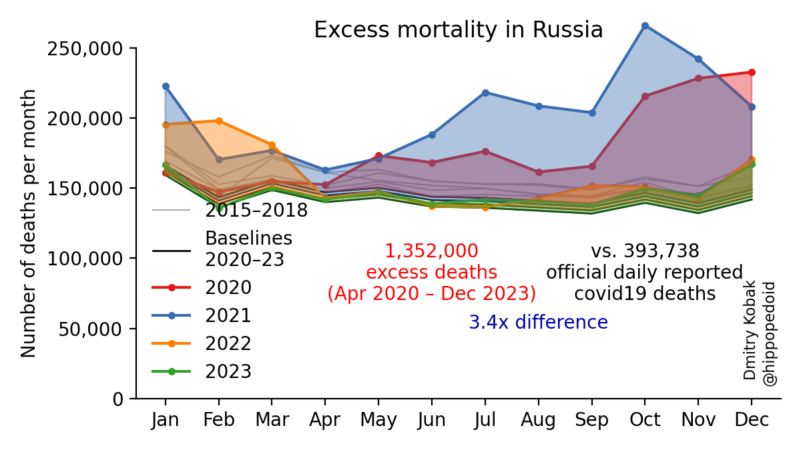
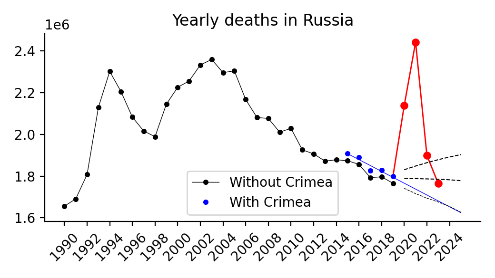

# Excess mortality during the COVID-19 pandemic

Code: https://github.com/dkobak/excess-mortality/blob/main/all-countries.ipynb 
Run in browser: https://colab.research.google.com/github/dkobak/excess-mortality/blob/main/all-countries.ipynb

Data source: https://github.com/akarlinsky/world_mortality

**Preprint:** Karlinsky & Kobak 2021, The World Mortality Dataset: Tracking excess mortality across countries during the COVID-19 pandemic, https://www.medrxiv.org/content/10.1101/2021.01.27.21250604v1

The data are sourced from the [World Mortality Dataset](https://github.com/akarlinsky/world_mortality). Excess mortality is computed relative to the baseline obtained using linear extrapolation of the 2015–19 trend. In the figure below, gray lines are 2015–19, black line is baseline for 2020, red line is 2020, purple line is 2021.

Red number: excess mortality starting from the first officially reported covid19 death. 
Gray number: excess mortality as a % of the baseline yearly deaths. 
Black number: excess mortality per 100,000 population. 
Blue number: ratio to the daily reported deaths over the same period (sourced from JHU).

Top-10 countries in the World Mortality Dataset according to different metrics: 

Compare with: [FT](https://www.ft.com/content/a2901ce8-5eb7-4633-b89c-cbdf5b386938), [NYT](https://www.nytimes.com/interactive/2020/04/21/world/coronavirus-missing-deaths.html), [The Economist](https://www.economist.com/graphic-detail/2020/07/15/tracking-covid-19-excess-deaths-across-countries), [WSJ](https://www.wsj.com/articles/the-covid-19-death-toll-is-even-worse-than-it-looks-11610636840)

### Extrapolation until today
Daily reported covid19 mortality and estimated excess mortality across the countries with the most reported covid19 deaths. Note that in this figure the excess mortality in all countries is ESTIMATED using the undercount coefficient times the LATEST daily reported number of deaths. So this corresponds to the gray markers in the figure above.

--------------------------

## Excess mortality in Russia

The code for my February 2021 paper in *Significance* [Excess mortality reveals Covid's true toll in Russia](https://rss.onlinelibrary.wiley.com/doi/10.1111/1740-9713.01486) is available in the `significance2021` folder, together with the frozen data and the final figures.

Figures below are updated every month. The up-to-date data can be found in the `russian-data` folder. Code: https://github.com/dkobak/excess-mortality/blob/main/russia.ipynb

  

Animation (English):

Animation (Russian):

  

Map (English):

Map (Russian):

Without regions:

 

Yearly deaths:

Detailed statistics in regions with the most excess deaths:

 

### Some technical figures

Extrapolation of the linear trend:

Seasonal variation:

Evolution of the undercount coefficient:

