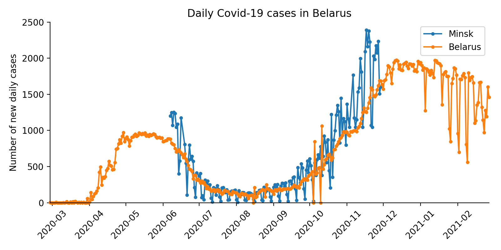
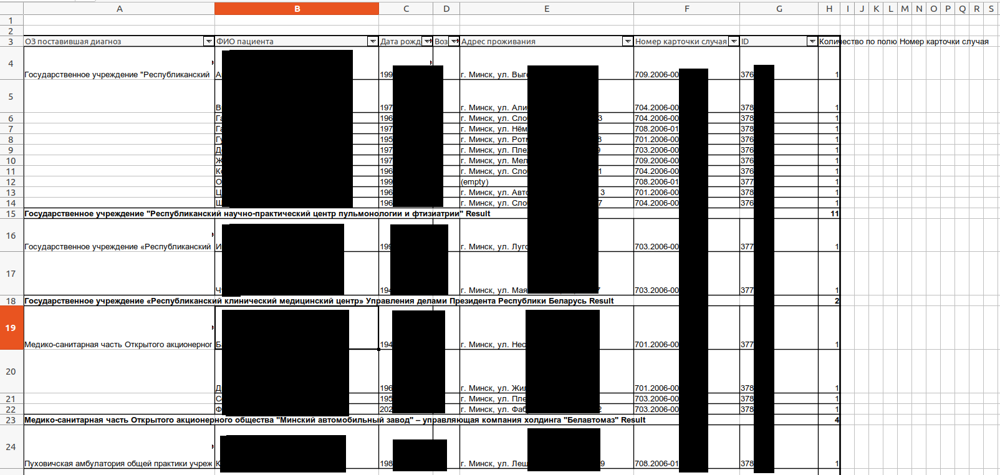
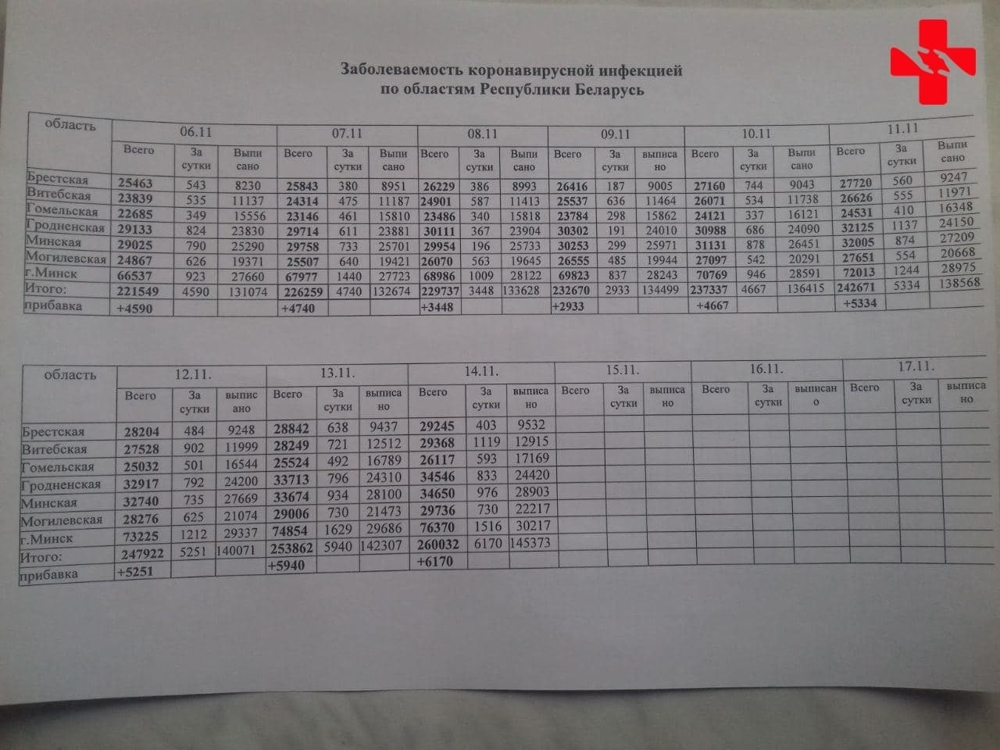
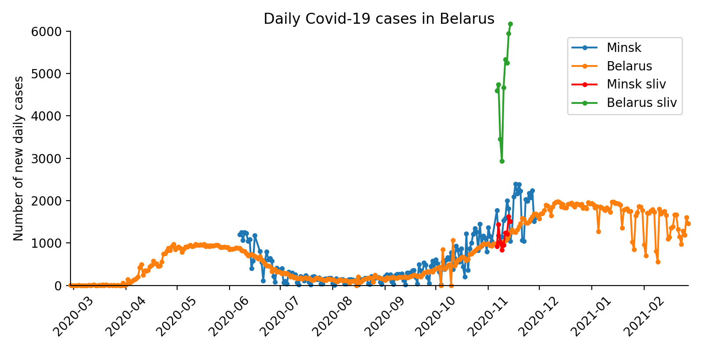

# Leaked data on new Covid-19 cases in Minsk, Belarus

An anonymous person from Belarus contacted me using an anonymous email address and said that they have leaked data 
about all confirmed Covid-19 cases in Minsk between June and November 2020 (число т.н. "экстренных извещений"; see http://minzdrav.gov.by/upload/dadvfiles/law/1106.pdf, page 46). I extracted the daily number of new cases in Minsk from these Excel spreadsheets (blue line in the figure above). It was often higher
than the official number of new cases in the entire Belarus (orange line). This suggests that the officially reported
number of cases was manipulated.

The processed data can be downloaded here: [`minsk.csv`](minsk.csv).

The original Excel spreadsheets I cannot share due to privacy reasons. They looked like this:

There is another evidence that the reported cases are not real (https://twitter.com/belteanews/status/1328265949489795073
):

Overlaying these numbers on the figure above yields this figure:

Note that there is also a purely statistical evidence suggesting that the reported number of cases in Belarus is falsified.
See my tweet here: https://twitter.com/hippopedoid/status/1361306449952071683.
