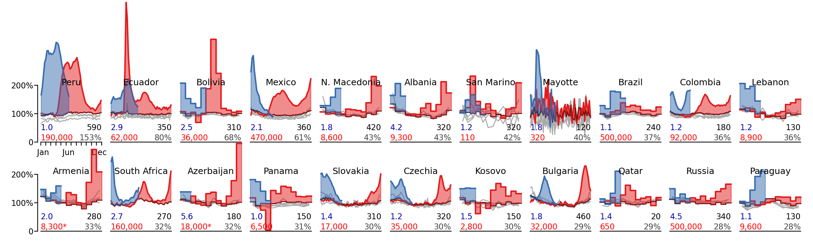

# Tracking excess mortality across countries during the COVID-19 pandemic with the World Mortality Dataset

**Ariel Karlinsky & Dmitry Kobak**

***eLife* 2021: https://elifesciences.org/articles/69336**

This folder contains the data and code reproducing the entire analysis for our eLife paper. 

The data were frozen on July 3, 2021, and are stored in the `frozen-data` folder. This corresponds to the World Mortality Dataset [commit `0aa90df`](https://github.com/akarlinsky/world_mortality/tree/0aa90dff37a43796ae763fa253e0262d22208ed7). For the exact sources of this frozen snapshot of the World Mortality Dataset see `frozen-data/world-mortality-sources.md`. 

The Python notebook saves all figures to the `figures` folder and outputs the analysis results as CSV files into the `export` folder. The resulting figures (in PDF and in PNG) as well as the CSV files are provided here directly.

For the up-do-date data and analysis (continuously updated after the paper was accepted), see https://github.com/akarlinsky/world_mortality (data) and https://github.com/dkobak/excess-mortality (analysis).

